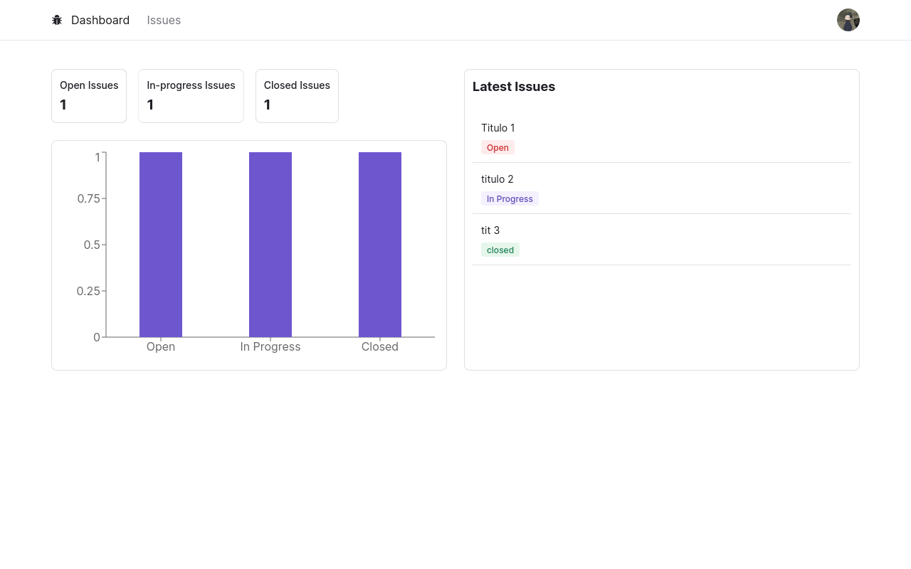
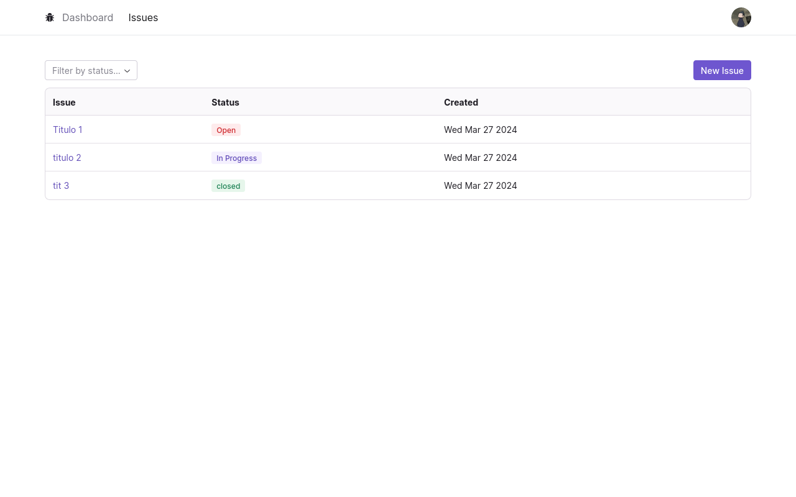
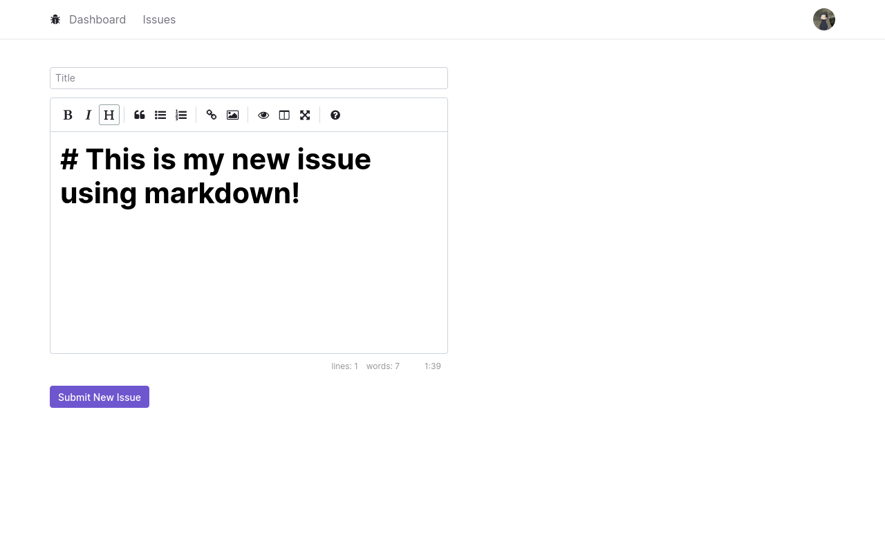
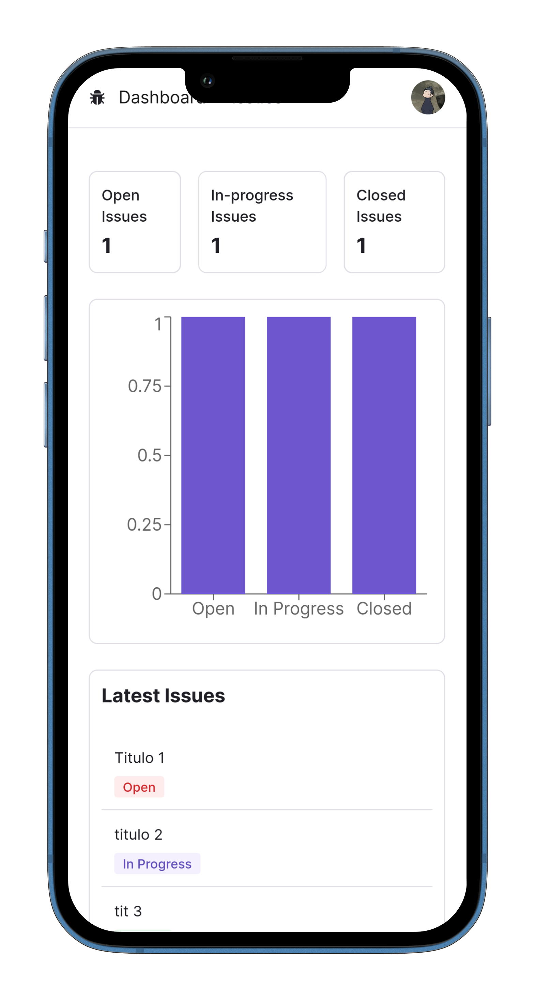
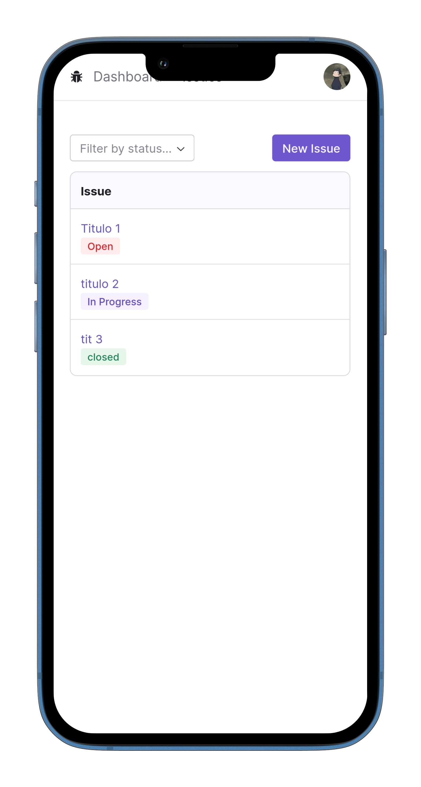
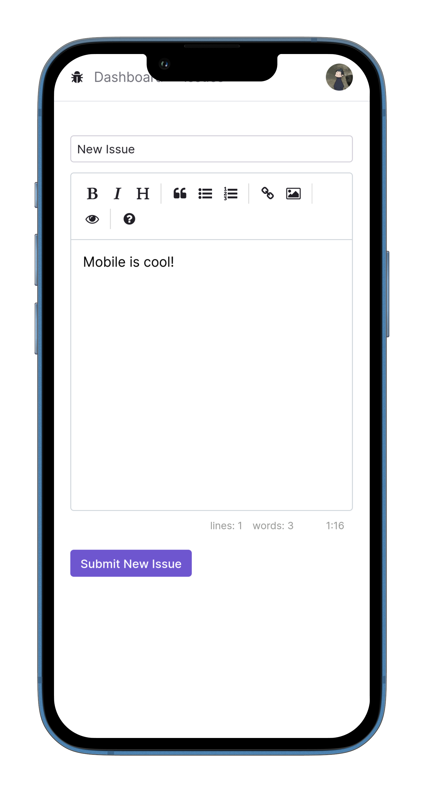

# Issue Tracker

## Pictures

### Desktop





---

### Mobile





---

## Getting Started

First, start the database:

```bash
docker compose up --build
```

Then start the server:

```bash
npm run dev
```

Open [http://localhost:3000](http://localhost:3000) with your browser to see the result.
